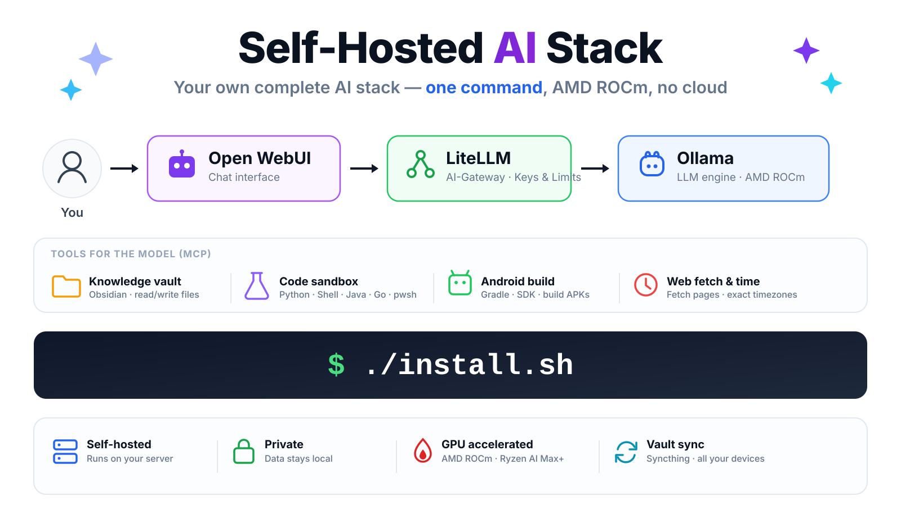

[Deutsch](README.md) | [English](README-en.md)

# Self-Hosted AI Stack

[](https://docs.docker.com/compose/) &nbsp;[](https://hub.docker.com/u/hwdsl2) &nbsp;[](https://opensource.org/licenses/MIT)

<p align="center">
  
</p>

A complete AI stack on your own hardware — **one command**, no cloud. Chat interface, LLM engine with AMD GPU acceleration, tools for the model (filesystem, web, code execution, Android builds), and your own knowledge base wired in.

- **One-command installer** — checks hardware and ROCm, sets up the firewall, pulls the default model, starts everything
- **GPU acceleration via AMD ROCm** — tuned for the **Ryzen AI Max+ 395** (Strix Halo, gfx1151)
- **Tools for the LLM** over MCP: filesystem, web fetch, exact timezones, GitHub, search, database
- **Code sandbox** — the model can **run and test** code before handing it to you (Python, shell, Java, Go, C++, optionally PowerShell)
- **Android build environment** — create, build and test projects (JDK, SDK, Gradle)
- **Your own knowledge base** — an Obsidian vault synced directly between your devices via Syncthing
- **Modern status dashboard** — see what's online at a glance, pull and unload models
- **Private** — runs fully locally by default, external providers optional through LiteLLM

## Quick start

```bash
git clone https://github.com/hwdsl2/self-hosted-ai-stack.git
cd self-hosted-ai-stack

./install.sh --check-only   # optional: check only, change nothing
./install.sh                # install and start
```

Afterwards `./scripts/show-credentials.sh` prints every URL and credential.

The full walkthrough — requirements, GPU setup and troubleshooting — is in the [installation docs](documentation/en/installation.md).

## Documentation

| Topic | Contents |
|---|---|
| **[Installation & getting started](documentation/en/installation.md)** | Requirements, installer, ROCm/GPU, uninstalling |
| **[Architecture & services](documentation/en/architecture.md)** | How the services fit together, ports, dashboard |
| **[Tools for the LLM (MCP)](documentation/en/tools.md)** | MCP Gateway, wiring into Open WebUI, **per-model checklist** |
| **[Code sandbox](documentation/en/code-sandbox.md)** | Running and testing code, workspace, more languages |
| **[Android development](documentation/en/android.md)** | Creating, building and testing projects |
| **[Knowledge base (vault)](documentation/en/knowledge-base.md)** | Wiring an Obsidian vault in via Syncthing or Vault-Bridge |
| **[Managing models](documentation/en/models.md)** | Pulling, unloading, registering with LiteLLM |
| **[Operations & maintenance](documentation/en/operations.md)** | Everyday commands, updates, backups, credentials |
| **[Security & remote access](documentation/en/security.md)** | Firewall, reverse proxy with login/MFA, internet access |
| **[Other stacks](documentation/en/other-stacks.md)** | CPU/NVIDIA variant, lightweight stacks, Podman, example pipelines |

> **New here and the tools do nothing?** Tool settings in Open WebUI apply **per model**. The five things that must be set are in the [checklist](documentation/en/tools.md#checklist-enabling-tools-per-model).

## Services at a glance

| Service | Purpose | Default port |
|---|---|---|
| **Open WebUI** | Chat interface | `3001` |
| **LiteLLM** | AI gateway (OpenAI-compatible), keys and limits | `4000` |
| **Ollama** | LLM engine (AMD ROCm) | internal only |
| **Dashboard** | Status of all services, model management | `8600` |
| **MCP Gateway** | Tools for the LLM, managing MCP servers | `3000` |
| **mcpo** | MCP → OpenAPI for Open WebUI, tool overview | `8800` |
| **Code sandbox** | Running and testing code | internal only |
| **Android build** | Gradle and Android SDK | internal only |
| **Syncthing** | Vault sync between your devices | `8384` |
| **PostgreSQL** | Database with pgvector | internal only |
| **Whisper / Embeddings** | Speech-to-text, text-to-vectors | `9000` / `8000` |

Details on each service: [Architecture & services](documentation/en/architecture.md).

## Community

- 📬 [Sign up for project updates](https://selfhostedstack.beehiiv.com/subscribe?utm_campaign=ai) (1-2 emails/month) — get free guides on deploying AI and VPN (PDF)
- 💬 Join the [r/selfhostedstack](https://www.reddit.com/r/selfhostedstack/) community for discussions and showcases
- ⭐ Star the repository if you find it useful — it helps others discover it

Self-Hosted AI Stack is maintained by the author of [Setup IPsec VPN](https://github.com/hwdsl2/setup-ipsec-vpn) (28k+ stars).

## License

MIT License — see [LICENSE.md](LICENSE.md).

This project is an independent Docker configuration and is not affiliated with, endorsed by, or sponsored by Docker, Inc., Ollama, Berri AI (LiteLLM), Hugging Face, hexgrad (Kokoro), OpenAI, SYSTRAN or MCPHub. Docker is a trademark or registered trademark of Docker, Inc.
