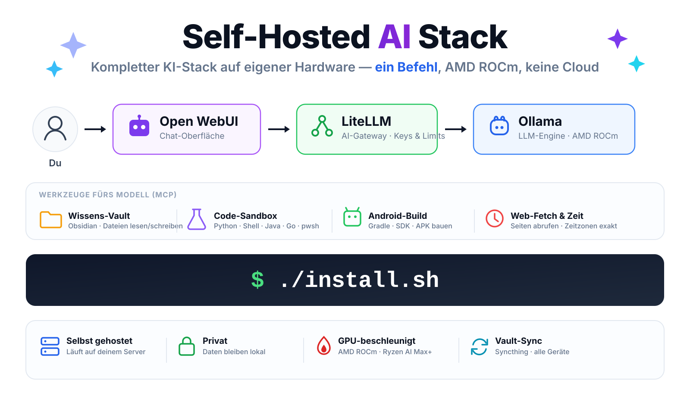

[Deutsch](README.md) | [English](README-en.md)

# Self-Hosted AI Stack

[](https://docs.docker.com/compose/) &nbsp;[](https://hub.docker.com/u/hwdsl2) &nbsp;[](https://opensource.org/licenses/MIT)

<p align="center">
  
</p>

Ein kompletter KI-Stack auf eigener Hardware — **ein Befehl**, keine Cloud. Chat-Oberfläche, LLM-Engine mit AMD-GPU-Beschleunigung, Werkzeuge fürs Modell (Dateisystem, Web, Code-Ausführung, Android-Builds) und die Anbindung der eigenen Wissensdatenbank.

- **Ein-Befehl-Installer** — prüft Hardware und ROCm, richtet die Firewall ein, lädt das Standardmodell, startet alles
- **GPU-Beschleunigung über AMD ROCm** — optimiert für den **Ryzen AI Max+ 395** (Strix Halo, gfx1151)
- **Werkzeuge fürs LLM** über MCP: Dateisystem, Web-Fetch, exakte Zeitzonen, GitHub, Suche, Datenbank
- **Code-Sandbox** — das Modell kann Code **ausführen und testen**, bevor es ihn dir gibt (Python, Shell, Java, Go, C++, optional PowerShell)
- **Android-Build-Umgebung** — Projekte anlegen, bauen und testen lassen (JDK, SDK, Gradle)
- **Eigene Wissensdatenbank** anbinden — Obsidian-Vault per Syncthing direkt zwischen deinen Geräten
- **Modernes Status-Dashboard** — sieh auf einen Blick, was online ist, lade und entlade Modelle
- **Privat** — läuft standardmäßig vollständig lokal, externe Anbieter optional über LiteLLM

## Schnellstart

```bash
git clone https://github.com/hwdsl2/self-hosted-ai-stack.git
cd self-hosted-ai-stack

./install.sh --check-only   # optional: nur prüfen, nichts ändern
./install.sh                # installieren und starten
```

Danach zeigt dir `./scripts/show-credentials.sh` alle URLs und Zugangsdaten.

Die ausführliche Anleitung samt Voraussetzungen, GPU-Einrichtung und Fehlersuche steht in der [Installationsdokumentation](documentation/de/installation.md).

## Dokumentation

| Thema | Inhalt |
|---|---|
| **[Installation & Erste Schritte](documentation/de/installation.md)** | Voraussetzungen, Installer, ROCm/GPU, Deinstallation |
| **[Architektur & Dienste](documentation/de/architektur.md)** | Zusammenspiel der Dienste, Ports, Dashboard |
| **[Werkzeuge fürs LLM (MCP)](documentation/de/werkzeuge.md)** | MCP Gateway, Anbindung an Open WebUI, **Checkliste pro Modell** |
| **[Code-Sandbox](documentation/de/code-sandbox.md)** | Code ausführen und testen lassen, Arbeitsbereich, weitere Sprachen |
| **[Android-Entwicklung](documentation/de/android.md)** | Projekte anlegen, bauen, testen |
| **[Wissensdatenbank (Vault)](documentation/de/wissensdatenbank.md)** | Obsidian-Vault per Syncthing oder Vault-Bridge anbinden |
| **[Modelle verwalten](documentation/de/modelle.md)** | Modelle laden, entladen, bei LiteLLM registrieren |
| **[Betrieb & Wartung](documentation/de/betrieb.md)** | Alltagsbefehle, Updates, Sicherung, Zugangsdaten |
| **[Sicherheit & Fernzugriff](documentation/de/sicherheit.md)** | Firewall, Reverse-Proxy mit Login/MFA, Internet-Zugriff |
| **[Weitere Stacks](documentation/de/weitere-stacks.md)** | CPU-/NVIDIA-Variante, leichtgewichtige Stacks, Podman, Beispiel-Pipelines |

> **Neu hier und die Werkzeuge tun nichts?** Werkzeug-Einstellungen gelten in Open WebUI **pro Modell**. Die fünf Punkte, die gesetzt sein müssen, stehen in der [Checkliste](documentation/de/werkzeuge.md#checkliste-werkzeuge-pro-modell-freischalten).

## Dienste im Überblick

| Dienst | Zweck | Standard-Port |
|---|---|---|
| **Open WebUI** | Chat-Oberfläche | `3001` |
| **LiteLLM** | AI-Gateway (OpenAI-kompatibel), Schlüssel und Limits | `4000` |
| **Ollama** | LLM-Engine (AMD ROCm) | nur intern |
| **Dashboard** | Status aller Dienste, Modellverwaltung | `8600` |
| **MCP Gateway** | Werkzeuge fürs LLM, MCP-Server verwalten | `3000` |
| **mcpo** | MCP → OpenAPI für Open WebUI, Werkzeug-Übersicht | `8800` |
| **Code-Sandbox** | Code ausführen und testen | nur intern |
| **Android-Build** | Gradle und Android SDK | nur intern |
| **Syncthing** | Vault-Sync zwischen deinen Geräten | `8384` |
| **PostgreSQL** | Datenbank mit pgvector | nur intern |
| **Whisper / Embeddings** | Sprache-zu-Text, Text-zu-Vektoren | `9000` / `8000` |

Details zu jedem Dienst: [Architektur & Dienste](documentation/de/architektur.md).

## Community

- 📬 [Für Projekt-Updates anmelden](https://selfhostedstack.beehiiv.com/subscribe?utm_campaign=ai) (1–2 E-Mails/Monat) — erhalte kostenlose Anleitungen zur Bereitstellung von KI und VPN (PDF)
- 💬 Tritt der [r/selfhostedstack](https://www.reddit.com/r/selfhostedstack/) Community für Diskussionen und Showcases bei
- ⭐ Gib dem Repository einen Stern, wenn du es nützlich findest — das hilft anderen, es zu entdecken

Self-Hosted AI Stack wird vom Autor von [Setup IPsec VPN](https://github.com/hwdsl2/setup-ipsec-vpn) (28k+ Sterne) gepflegt.

## Lizenz

MIT-Lizenz — siehe [LICENSE.md](LICENSE.md).

Dieses Projekt ist eine unabhängige Docker-Konfiguration und ist nicht mit Docker, Inc., Ollama, Berri AI (LiteLLM), Hugging Face, hexgrad (Kokoro), OpenAI, SYSTRAN oder MCPHub verbunden, wird von ihnen nicht unterstützt oder gesponsert. Docker ist eine Marke oder eingetragene Marke von Docker, Inc.
