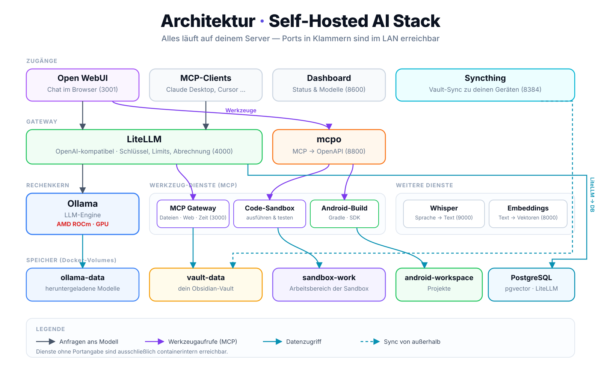
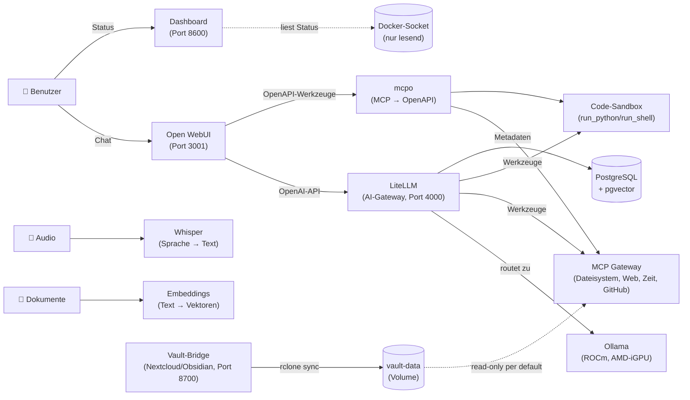

# Architektur & Dienste

Wie die Dienste zusammenspielen, welche Ports belegt sind und was das Dashboard zeigt.

[← Zur Übersicht](../../README.md) &nbsp;|&nbsp; [English version](../en/architecture.md)

**Dokumentation:** [Installation & Erste Schritte](installation.md) · **Architektur & Dienste** · [Werkzeuge fürs LLM (MCP)](werkzeuge.md) · [LibreChat (zweite Oberfläche)](librechat.md) · [Code-Sandbox](code-sandbox.md) · [Android-Entwicklung](android.md) · [Wissensdatenbank (Vault)](wissensdatenbank.md) · [Modelle verwalten](modelle.md) · [Betrieb & Wartung](betrieb.md) · [Sicherheit & Fernzugriff](sicherheit.md) · [Weitere Stacks](weitere-stacks.md)

---

<p align="center">
  
</p>

> Das Diagramm zeigt den Stand des ROCm-Stacks. Das textbasierte Diagramm weiter unten enthält dieselben Beziehungen in Mermaid-Form.

## Architektur



**Zugangsdaten anzeigen**

```bash
./scripts/show-credentials.sh
```

Zeigt alle URLs, den LiteLLM-Master-Key, das Postgres-Passwort und den MCP-API-Key direkt aus deiner `.env` an — kein `docker exec ... _manage` nötig (das gibt es nur in den alten `hwdsl2`-Images, nicht in den hier verwendeten Upstream-Images). Open WebUI hat kein vorgegebenes Passwort: Der **erste Account**, den du unter `http://<server-ip>:3001` registrierst, wird automatisch Admin.

## Enthaltene Dienste

| Dienst | Rolle | Standard-Port |
|---|---|---|
| **[Ollama (LLM)](https://github.com/hwdsl2/docker-ollama)** | Führt lokale LLM-Modelle aus (llama3, qwen, mistral usw.) | `11434` |
| **[AnythingLLM](https://github.com/mintplex-labs/anything-llm)** | Web-basierte Chat-Oberfläche — standardmäßig passwortgeschützt | `3001` |
| **[LiteLLM](https://github.com/hwdsl2/docker-litellm)** | KI-Gateway mit Admin-UI — leitet Anfragen an Ollama und 100+ Anbieter weiter | `4000` |
| **[Embeddings](https://github.com/hwdsl2/docker-embeddings)** | Wandelt Text in Vektoren um für semantische Suche und RAG | `8000` |
| **[Whisper (STT)](https://github.com/hwdsl2/docker-whisper)** | Transkribiert gesprochenes Audio in Text | `9000` |
| **[WhisperLive (Echtzeit-STT)](https://github.com/hwdsl2/docker-whisper-live)** | Echtzeit-Transkription von Sprache zu Text über WebSocket | `9090` |
| **[Kokoro (TTS)](https://github.com/hwdsl2/docker-kokoro)** | Wandelt Text in natürlich klingende Sprache um | `8880` |
| **[MCP Gateway](https://github.com/hwdsl2/docker-mcp-gateway)** | Stellt MCP-Werkzeuge (Dateisystem, Fetch, GitHub, Suche, Datenbanken) für KI-Clients bereit | `3000` |
| **[Docling](https://github.com/hwdsl2/docker-docling)** | Wandelt Dokumente (PDF, DOCX usw.) in strukturierten Text/Markdown um | `5001` |

## Dashboard

Der Stack bringt ein eigenes, schlankes **modernes Status-Dashboard** mit (`dashboard/`). Es liest den Docker-Socket (nur lesend) und zeigt in Echtzeit, **welche Dienste online sind, auf welchem Port sie laufen** und verlinkt direkt darauf. Es aktualisiert sich automatisch und ist unter `http://<server-ip>:8600` erreichbar.

**Ollama-Details & Modellverwaltung:** Die Ollama-Kachel ist doppelt so breit wie die anderen und hat einen **„Details"**-Knopf, der ein Popup öffnet mit:

- **Modelle laden:** Eingabefeld für einen Ollama-Bibliotheksnamen (`llama3.1:8b`) oder eine Hugging-Face-Referenz (`hf.co/user/repo:tag`) — Ollama akzeptiert beides über denselben Mechanismus. **Mehrere Downloads gleichzeitig** sind möglich, jeder mit eigenem Live-Fortschrittsbalken.
- **Aktuell im Speicher:** die gerade geladenen Modelle mit belegtem (V)RAM, Aktivitäts-Indikator und verbleibender Zeit bis zum automatischen Entladen (Ollama hat keine direkte „läuft gerade eine Anfrage"-API; das Dashboard nähert das an, indem es erkennt, wenn sich die Keep-Alive-Zeit eines Modells durch eine neue Anfrage verlängert). Jedes davon hat einen **„Jetzt entladen"**-Knopf, der den Speicher sofort freigibt, statt auf den Ablauf-Timer zu warten — praktisch, wenn ein Modell klemmt oder du den VRAM für ein anderes brauchst. Das Modell bleibt dabei installiert und wird beim nächsten Aufruf einfach neu geladen (deshalb ohne Sicherheitsabfrage).
- **Installierte Modelle:** Liste aller heruntergeladenen Modelle mit Größe und „Löschen"-Knopf (mit Sicherheitsabfrage).

Aktualisiert sich alle 3 Sekunden, solange das Popup offen ist.

> ⚠️ **Sicherheitshinweis:** Damit wird das Dashboard erstmals **schreibfähig** (Modelle laden/löschen), nicht nur lesend. Da es weiterhin nur im LAN erreichbar und ohne eigenes Login ist, kann jeder im selben Netz Downloads anstoßen oder Modelle löschen. Für ein Einzelnutzer-Heimnetz ein vertretbarer Kompromiss — falls nicht gewünscht, das Dashboard zusätzlich hinter einen eigenen Login/Reverse-Proxy stellen (siehe unten) oder den `dashboard`-Dienst ganz weglassen.

#### Dashboard mit Login/MFA absichern

Das Dashboard hat **bewusst keine eigene Benutzerverwaltung**. Mehrbenutzer-Login, MFA, Sessions und Geräte-Wiedererkennung selbst zu implementieren ist genau die Sorte Code, bei der Fehler zu echten Sicherheitslücken werden — dafür gehört ein dedizierter Authentifizierungs-Proxy davor, kein selbstgebautes Login in einem Status-Skript.

Bewährter Weg mit [Pangolin](https://docs.pangolin.net/) (oder gleichwertig Authelia/Authentik/Cloudflare Access):

1. Im Reverse-Proxy eine **HTTP-Ressource** anlegen, Ziel `http://<server-ip>:8600` (bzw. `PORT_DASHBOARD`).
2. Einen **Identitätsanbieter** einrichten bzw. lokale Benutzer anlegen — dort kommen die einzelnen Konten hin.
3. **MFA pro Benutzer** aktivieren; Sessions und Wiedererkennung bekannter Geräte übernimmt der Proxy (unbekanntes Gerät → Login + MFA, gültige Session → direkt durch).
4. Über die **Zugriffskontrolle** festlegen, wer die Ressource sehen darf.
5. Anschließend den direkten Port dichtmachen, damit niemand am Proxy vorbeikommt: `FIREWALL_MODE=lan` in der `.env` (bzw. den Port aus der Firewall-Freigabe nehmen).

Dasselbe Vorgehen passt für alle anderen Oberflächen ohne eigenes Login — insbesondere die Vault-Bridge, die mcpo-Werkzeugübersicht und Syncthings Web-UI.

> Umgekehrt gilt: Was **API-Aufrufe** entgegennimmt (die LiteLLM-API, der MCP-Endpunkt), verträgt kein browserbasiertes Login-Portal davor — dort blockiert der Anmelde-Flow die Aufrufe. Diese Dienste bringen ihre eigene Absicherung per Bearer-Key mit; für Fernzugriff darauf besser ein Client-basiertes/privates Ressourcenmodell (VPN/Tunnel) statt eines Login-Portals nutzen.
