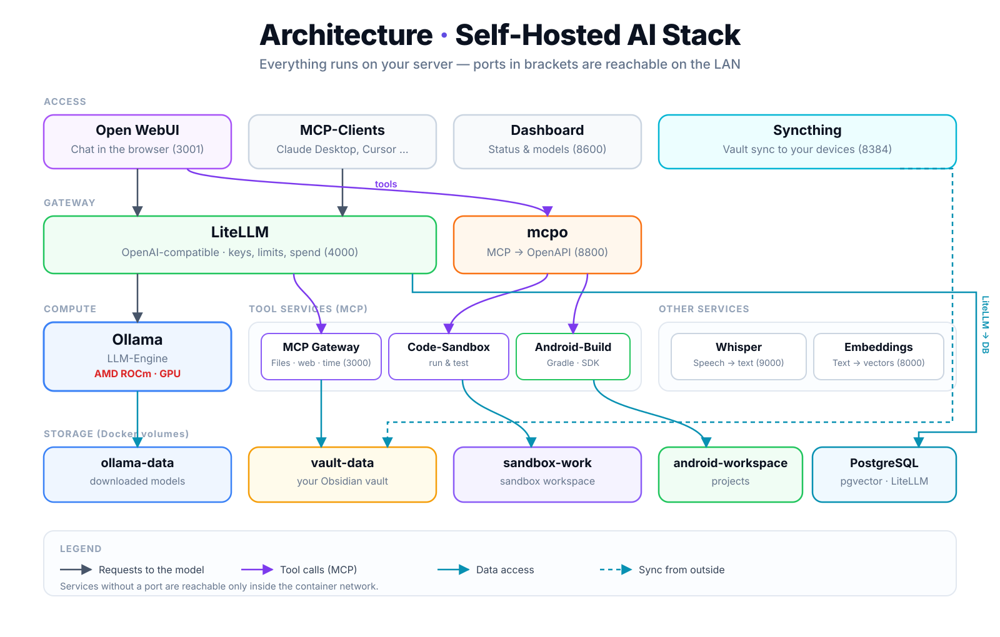
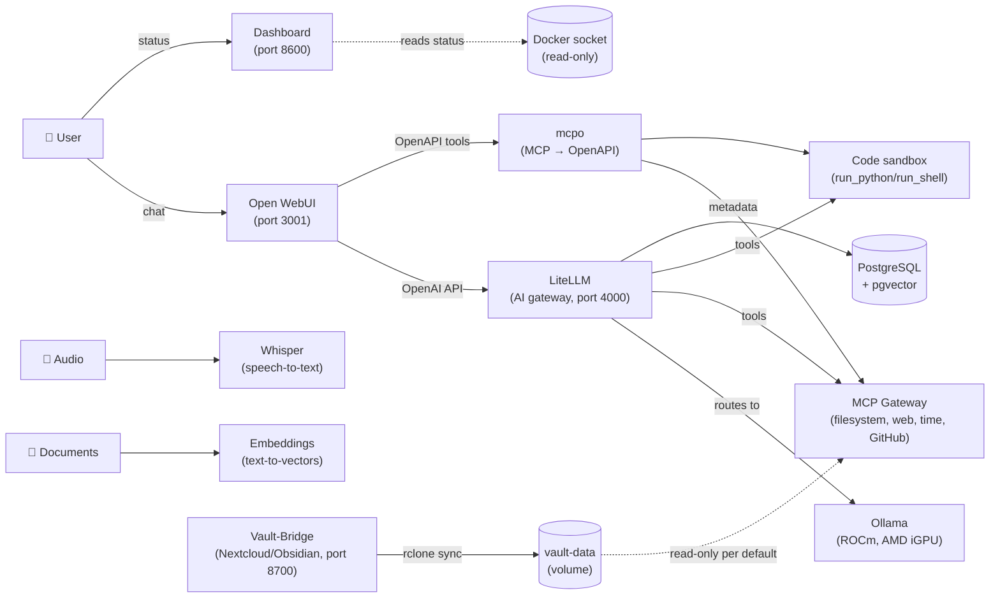

# Architecture & services

How the services fit together, which ports are used, and what the dashboard shows.

[← Back to overview](../../README-en.md) &nbsp;|&nbsp; [Deutsche Fassung](../de/architektur.md)

**Documentation:** [Installation & getting started](installation.md) · [Control center (menu)](control-center.md) · **Architecture & services** · [Tools for the LLM (MCP)](tools.md) · [LibreChat (second UI)](librechat.md) · [Code sandbox](code-sandbox.md) · [Open Interpreter (CLI)](open-interpreter.md) · [Android development](android.md) · [Exchange Bridge](exchange-bridge.md) · [Knowledge base (vault)](knowledge-base.md) · [Managing models](models.md) · [Operations & maintenance](operations.md) · [Security & remote access](security.md) · [Other stacks](other-stacks.md)

---

<p align="center">
  
</p>

> The diagram reflects the ROCm stack. The text-based diagram further down expresses the same relationships in Mermaid form.

## Architecture



**Show credentials**

```bash
./scripts/show-credentials.sh
```

Prints every URL, the LiteLLM master key, the Postgres password, and the MCP API key straight from your `.env` — no `docker exec ... _manage` needed (that only exists in the old `hwdsl2` images, not the upstream images used here). Open WebUI has no seeded password: the **first account** you register at `http://<server-ip>:3001` automatically becomes admin.

## Included services

| Service | Role | Default port |
|---|---|---|
| **[Ollama (LLM)](https://github.com/hwdsl2/docker-ollama)** | Runs local LLM models (llama3, qwen, mistral, etc.) | `11434` |
| **[AnythingLLM](https://github.com/mintplex-labs/anything-llm)** | Web-based chat UI — password-protected by default | `3001` |
| **[LiteLLM](https://github.com/hwdsl2/docker-litellm)** | AI gateway with Admin UI — routes requests to Ollama and 100+ providers | `4000` |
| **[Embeddings](https://github.com/hwdsl2/docker-embeddings)** | Converts text to vectors for semantic search and RAG | `8000` |
| **[Whisper (STT)](https://github.com/hwdsl2/docker-whisper)** | Transcribes spoken audio to text | `9000` |
| **[WhisperLive (real-time STT)](https://github.com/hwdsl2/docker-whisper-live)** | Real-time speech-to-text transcription over WebSocket | `9090` |
| **[Kokoro (TTS)](https://github.com/hwdsl2/docker-kokoro)** | Converts text to natural-sounding speech | `8880` |
| **[MCP Gateway](https://github.com/hwdsl2/docker-mcp-gateway)** | Provides MCP tools (filesystem, fetch, GitHub, search, databases) to AI clients | `3000` |
| **[Docling](https://github.com/hwdsl2/docker-docling)** | Converts documents (PDF, DOCX, etc.) to structured text/Markdown | `5001` |

## Dashboard

The stack ships a small, self-contained **modern status dashboard** (`dashboard/`). It reads the Docker socket (read-only) and shows in real time **which services are online, which port they run on**, and links straight to them. It refreshes automatically and is available at `http://<server-ip>:8600`.

**Ollama details & model management:** the Ollama tile is twice as wide as the others and has a **"Details"** button opening a popup with:

- **Load models:** a text field for an Ollama library name (`llama3.1:8b`) or a Hugging Face reference (`hf.co/user/repo:tag`) — Ollama accepts both through the same mechanism. **Multiple downloads at once** are supported, each with its own live progress bar.
- **Currently in memory:** the models loaded right now with their (V)RAM footprint, an activity indicator and the time remaining until auto-unload (Ollama has no direct "is a request running right now" API; the dashboard approximates this by detecting when a model's keep-alive time gets extended by a fresh request). Each one has an **"Unload now"** button that frees the memory immediately instead of waiting for the expiry timer — handy when a model is stuck or you need the VRAM for another one. The model stays installed and is simply reloaded on the next call (hence no confirmation prompt).
- **Installed models:** a list of every downloaded model with its size and a "Delete" button (with a confirmation prompt).

Refreshes every 3 seconds while the popup is open.

> ⚠️ **Security note:** this makes the dashboard **write-capable** for the first time (loading/deleting models), not just read-only. Since it's still LAN-only and has no login of its own, anyone on the same network can trigger downloads or delete models. For a single-user home network this is a reasonable tradeoff — if that's not acceptable, put the dashboard behind its own login/reverse proxy (see below), or drop the `dashboard` service entirely.

#### Protecting the dashboard with login/MFA

The dashboard **deliberately has no user management of its own**. Implementing multi-user login, MFA, sessions and device recognition yourself is exactly the kind of code where mistakes turn into real security holes — that calls for a dedicated authentication proxy in front, not a hand-rolled login inside a status script.

The proven route with [Pangolin](https://docs.pangolin.net/) (or equally Authelia/Authentik/Cloudflare Access):

1. Create an **HTTP resource** in the reverse proxy, target `http://<server-ip>:8600` (i.e. `PORT_DASHBOARD`).
2. Set up an **identity provider** or create local users — that's where the individual accounts live.
3. Enable **MFA per user**; sessions and recognition of known devices are handled by the proxy (unknown device → login + MFA, valid session → straight through).
4. Use **access control** to define who may see the resource.
5. Then close off the direct port so nobody can bypass the proxy: `FIREWALL_MODE=lan` in `.env` (or drop the port from the firewall rules).

The same approach fits every other UI without its own login — in particular the Vault-Bridge, the mcpo tool overview, and Syncthing's web UI.

> The inverse also holds: anything that accepts **API calls** (the LiteLLM API, the MCP endpoint) cannot sit behind a browser-based login portal — the sign-in flow blocks those calls. Those services carry their own bearer-key protection; for remote access to them, prefer a client-based/private resource model (VPN/tunnel) over a login portal.
